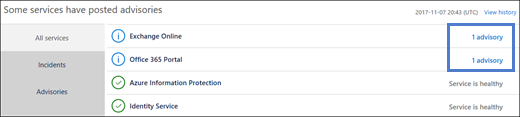

# Office 365 서비스 상태를 확인 하는 방법How to check Office 365 service health

관리 센터에서 Office 365 **서비스 상태** 페이지에서 Office 365, Yammer, Microsoft Dynamics CRM 및 Microsoft Intune 클라우드 서비스의 상태를 볼 수 있습니다. 클라우드 서비스에 문제가 발생 하는 경우에 지원팀에 문의 하거나 시간을 백분율로 나타내는 시간 문제를 해결 하기 전에 진행 중인 해상도 알려진된 문제가 인지 여부를 확인 하려면 서비스 상태를 확인할 수 있습니다.You can view the health of Office 365, Yammer, Microsoft Dynamics CRM, and Microsoft Intune cloud services on the Office 365 **Service health** page in the admin center. If you are experiencing problems with a cloud service, you can check the service health to determine whether this is a known issue with a resolution in progress before you call support or spend time troubleshooting. 
  
### 서비스 상태를 확인 하는 방법How to check service health

1. 이동 [https://portal.office.com/adminportal/home](https://portal.office.com/adminportal/home#/homepage) 와 관리자 계정 사용 하 여 로그인 합니다.Go to [https://portal.office.com/adminportal/home](https://portal.office.com/adminportal/home#/homepage) and sign in with an admin account. 
    
    > [!NOTE]
    > 전역 관리자 또는 서비스 관리자 역할에 할당 된 사용자 서비스 상태를 볼 수 있습니다. Exchange, SharePoint 및 Skype 비즈니스 관리자에 대 한 서비스 상태를 볼 수 있도록도 할당 해야 서비스 관리자 역할입니다.People who are assigned the global admin or service administrator role can view service health. To allow Exchange, SharePoint, and Skype for Business admins to view service health, they must also be assigned the Service admin role. 
  
2. 관리 센터에서 서비스 상태를 열려면 **상태**로 이동 > **서비스 상태**하거나 **홈 대시보드** **서비스 상태 카드** 를 클릭 합니다. 대시보드 카드 활성 서비스 문제 및 자세한 서비스 상태 페이지에 대 한 링크를 인지를 나타냅니다.To open service health, in the admin center, go to **Health** > **Service health**, or click the **Service health card** on the **Home dashboard**. The dashboard card indicates whether there is an active service issue and links to the detailed service health page.
    
    
  
3. 각 클라우드 서비스의 상태는 가능한 상태를 나타낼 수를 아이콘으로 표 서식을에 표시 됩니다.The health state of each cloud service is shown in a table format with an icon to indicate possible states.
    
> [!TIP]
> 푸시 알림 최신 정보를 얻을 수 있는 뛰어난 방식에 해당 하는 서비스 상태를 보려면 모바일 장치에서 [Office 365 관리자 app](https://go.microsoft.com/fwlink/p/?linkid=627216) 를 사용할 수 있습니다.You can also use the [Office 365 Admin app](https://go.microsoft.com/fwlink/p/?linkid=627216) on your mobile device to view Service health, which is a great way to stay current with push notifications. 
  
### 게시 된 서비스 상태의 세부 정보 보기View details of posted service health

기본 보기에서 모든 서비스 및 현재 상태 상태로 표시 됩니다. 인시던트를 발생 하는 현재 서비스에 보기를 필터링 하려면 음영 처리 된 막대를 왼쪽에에서 **인시던트** 를 선택 합니다. **권고** 를 선택 하면 현재 게시 하는 권고를가지고 있는 서비스에만 표시 됩니다. **모든 서비스** 보기에서 표시 된 서비스의 상태를 클릭 하면 자문 또는 사고 요약 보기를 열립니다.In the default view, all services and their current health state are displayed. To filter your view to services currently experiencing an incident, select **Incidents** from the shaded bar on the left. Selecting **Advisories** will show only services that currently have an advisory posted. From the **All services** view, clicking the displayed service state will open a summary view of the advisory or incident. 
  

  
자문 또는 인시던트 요약에 다음 정보를 제공 합니다.The advisory or incident summary provides the following information: 
  

  
1. 문제 식별자 및 요약 문인 문제입니다.An issue identifier and summary statement of the problem.
    
2. 현재 상태입니다. 잠재적인 각 상태에 대 한이 문서의 상태 정의 참조 하십시오.The current status. See status definitions in this article for an explanation of each potential status.
    
3. 이 문제 사용자가 영향을 줄 수는 방법에 대 한 설명.A description of how this issue can affect users.
    
4. 문제가 시작 된 시간 및 마지막으로 서비스 상태 메시지 업데이트 되었습니다. 문제 기간 동안 진행률 솔루션에 적용에 만드는 것을 알 수 있도록 자주 메시지 게시 하는 합니다.The time that the issue was started and the last time that the service health message was updated. Throughout the duration of an issue we post frequent messages to let you know the progress that we're making in applying a solution.
    
5. 솔루션에서 작업 하는 동안 게시 한 모든 메시지의 역사를 포함 하 여 문제에 대 한 자세한 내용을 보려면 **자세한 정보 표시** 링크를 선택 합니다.Select the **Show details** link to see more details about the issue, including the history of all messages posted while we work on a solution. 
    
### 서비스 상태 정보를 변환 합니다.Translate service health details

서비스 상태 설명을 실시간에 게시 하 고 해당 하는 언어를 자동으로 번역 되지 않은 서비스 이벤트의 세부 정보는 영어로 때문입니다. 설명 번역을 하려면 다음이 단계를 따릅니다.Because service health explanations are posted in real-time, they are not automatically translated to your language and the details of a service event are in English only. To translate the explanation, follow these steps:
  
1. [변환기 (영문)](https://www.bing.com/translator/)로 이동 합니다.Go to [Translator](https://www.bing.com/translator/).
    
2. **서비스 상태** 페이지에서 인시던트 또는 자문을 선택 합니다. **자세한 정보 표시**에서 문제에 대 한 텍스트를 복사 합니다.On the **Service health** page, select an incident or advisory. Under **Show details**, copy the text about the issue.
    
3. 변환기 (영문), 텍스트를 붙여 고 **번역**을 선택 합니다.In Translator, paste the text and choose **Translate**.
    
### 정의Definitions

대부분의 시간 서비스에 자세한 정보 없이와 같이 정상 표시 됩니다. 서비스에 문제가 발생 하 고, 문제 권고를 배포할 또는 인시던트로 식별 하 고 현재 상태를 표시 합니다.Most of the time services will appear as healthy with no further information. When a service is having a problem, the issue is identified as either an advisory or an incident and shows a current status.
  
> [!TIP]
> 이벤트 서비스 상태에 표시 되지않는 유지 관리를 계획 합니다. **메시지 센터**와 최신 상태로 유지 하 여 계획 된 유지 관리 이벤트를 추적할 수 있습니다. 될 수행 되는 변경 될 때, 해당 효과 및 그에 대 한 준비 하는 방법을 알아낼 변경에 대 한 계획으로 분류 된 메시지를 필터링 합니다. 자세한 내용은 [Office 365의 메시지 센터](https://support.office.com/article/38fb3333-bfcc-4340-a37b-deda509c2093) 를 참고 하십시오.Planned maintenance events aren't shown in service health. You can track planned maintenance events by staying up to date with the **Message center**. Filter to messages categorized as Plan for change to find out when the change is going to happen, its effect, and how to prepare for it. See [Message center in Office 365](https://support.office.com/article/38fb3333-bfcc-4340-a37b-deda509c2093) for more details. 
  
### 사고 및 권고Incidents and advisories

|||
|:-----|:-----|
||서비스 표시 된 권고를 배포할 경우 일부 사용자에 게 영향을 주는 하는 문제를 알고 있습니다 하지만 서비스는 계속 사용할 수 있습니다. 권고에서 종종 문제를 해결 방법이 및 문제가 간헐적으로 찼거나 범위 및 사용자 영향에 제한 됩니다.If a service has an advisory shown, we are aware of a problem that is affecting some users, but the service is still available. In an advisory, there is often a workaround to the problem and the problem may be intermittent or is limited in scope and user impact.    |
||서비스에 표시 된 현재 인시던트 있으면 것이 중요 한 문제 및 서비스 또는 서비스의 주요 함수를 사용할 수 없습니다. 등 사용자가 전자 메일 송수신 하는 작업을 할 수 있습니다 또는 로그인 수 없음 사고 미치는 영향이 눈에 띄는 사용자에 게 합니다. 진행 중인 인시던트 때 조사, 완화 노력이 및 서비스 상태 대시보드에서 해결 방법에 대 한 확인에 대 한 업데이트 제공할 것입니다.If a service has an active incident shown, it's a critical issue and the service or a major function of the service is unavailable. For example, users may be unable to send and receive email or unable to sign-in. Incidents will have noticeable impact to users. When there is an incident in progress, we will provide updates regarding the investigation, mitigation efforts, and confirmation of resolution in the Service health dashboard.    |
   
### 상태 정의Status definitions

|**상태****Status**|**정의****Definition**|
|:-----|:-----|
|**조사****Investigating** | 잠재적인 문제를 알고 있어야 하 고 무슨 및 영향의 범위에 대 한 자세한 정보를 수집 합니다.We're aware of a potential issue and are gathering more information about what's going on and the scope of impact. |
|**서비스 저하****Service degradation** | 서비스 또는 기능 사용에 영향을 미칠 수 있는 문제 인지 확인 했을 때 했습니다. 서비스 평소 보다 느리게 작동 하는 경우에이 상태를 볼 수 있습니다, 간헐적으로 중단 아니거나 예는 기능이 작동 하지 않습니다.We've confirmed that there is an issue that may affect use of a service or feature. You might see this status if a service is performing more slowly than usual, there are intermittent interruptions, or if a feature isn't working, for example. |
|**서비스 중단****Service interruption** | 문제 사용자가 서비스에 액세스 하는 기능에 영향을 줍니다 판단 되는 경우이 상태를 볼 수 있습니다. 이 경우이 문제는 중요 하 고 일관 되 게 재현할 수 있는 합니다.You'll see this status if we determine that an issue affects the ability for users to access the service. In this case, the issue is significant and can be reproduced consistently. |
|**서비스 복원****Restoring service** | 문제의 원인을 확인 되었습니다, 어떤 정정 작업을 수행할가 정상 상태를 다시 서비스를로 가져오기 진행 하 고 있습니다.The cause of the issue has been identified, we know what corrective action to take, and are in the process of bringing the service back to a healthy state. |
|**확장 된 복구****Extended recovery** | 이 상태는 수정 조치 대부분 사용자에 게 서비스를 복원 하는 진행 중인 하지만 영향을 받는 모든 시스템을 연결 하려면 시간이 다소 걸릴 수를 나타냅니다. 이 상태는 영구 수정 프로그램을 적용 하려면 기다리는 동안 영향을 줄일 수를 수정 하는 임시 만들었고 하는 경우에 나타날 수 있습니다.This status indicates that corrective action is in progress to restore service to most users but will take some time to reach all the affected systems. You might also see this status if we've made a temporary fix to reduce impact while we wait to apply a permanent fix. |
|**일시 중단 조사****Investigation suspended** | 자세히 조사 수 있게 하려면 고객의 추가 정보에 대 한 요청에서 잠재적인 문제를 사용해 자세히 조사 결과, 하는 경우에이 상태가 표시 됩니다. 작업을 수행할 수 있습니다, 필요한 경우 하면 됩니다 필요한 수 있는 데이터 나 로그를 확인 합니다.If our detailed investigation of a potential issue results in a request for additional information from customers to allow us to investigate further, you'll see this status. If we need you to act, we'll let you know what data or logs we need. |
|**서비스 복원****Service restored** | 정정 나타난 근본 문제 및 서비스는 정상 상태로 복원 해결을 확인 했을 때 했습니다. 무엇이 찾으려면 문제 세부 정보를 표시 합니다.We've confirmed that corrective action has resolved the underlying problem and the service has been restored to a healthy state. To find out what went wrong, view the issue details. |
|**게시 된 이후 문제 보고서****Post-incident report published** | 루트 원인 정보 및 비슷한 문제가 발생 하지 확인 하려면 다음 단계를 포함 하는 특정 문제에 대 한 게시물 위해 문제 보고서를 게시 한 했습니다.We’ve published a Post Incident Report for a specific issue that includes root cause information and next steps to ensure a similar issue doesn’t reoccur. |
   
## 기록History

서비스 상태를 사용 하 여 현재 상태를 확인 하 고 지난 30 일간의 모든 서비스 권고 및 사고의 기록을 볼 수 있습니다. 모든 서비스의 지난 상태를 보려면 **서비스 상태** 페이지에서 **기록 보기를** 선택 합니다.Service health lets you look at current health status and view the history of any service advisories and incidents in the past 30 days. To view the past health of all services, select **View history** on the **Service health** page. 
  

  
아래와 같이 선택 된 시간 내에 게시 된 모든 서비스 상태 메시지 목록이 표시 됩니다.A list of all service health messages posted in the selected timeframe is displayed, as shown below:
  

  
7 일이 지난 또는 지난 30 일에 대 한 상태 기록을 볼 수 있습니다. 이 문제에 대 한 자세한 세부 정보를 보려면 모든 행을 선택 합니다.You may view the health history for either the last 7 days or last 30 days. Select any row to view more details about that issue.
  
가동 시간을 위한 노력 하는 방법에 대 한 자세한 내용은 [Office 365에서 투명 하 게 작업](https://go.microsoft.com/fwlink/?linkid=848695)을 참조 하십시오.For more information about our commitment to uptime, see [Transparent operations from Office 365](https://go.microsoft.com/fwlink/?linkid=848695).
  
## 의견을 제공합니다Leave feedback

진행 중인 문제에 대 한가 제공 하는 정보 시기 적절 하 게, 정확 하 고 유용한 인지 확인 하는 목적이 있습니다. 저희에 게 알려주십시오을 어떻게 수행 되는 작업, 별 등급을 선택 합니다. 하면 귀하에 게 우리는 점수 1에서 별 5 개를 한 후에 특정 한 세부 정보에 피드백을 제공할 수 있습니다. 여러분의 의견을 사용해 서비스 상태 시스템을 미세 조정할 사용 합니다.Our goal is to make sure that the information we provide to you about an ongoing issue is timely, accurate, and useful. To tell us how we're doing, select a star rating. After you give us a score from 1 to 5 stars, you can give feedback on any specific details. We'll use your feedback to fine-tune our service health system.
  

  
## 참고 항목See also

[Office 365 관리 센터에서 활동 보고서Activity Reports in the Office 365 admin center](https://support.office.com/article/0d6dfb17-8582-4172-a9a9-aed798150263)

