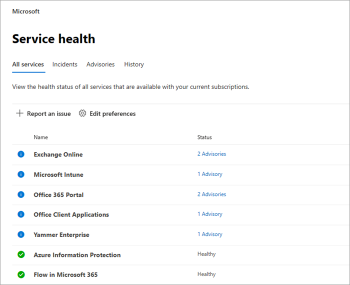
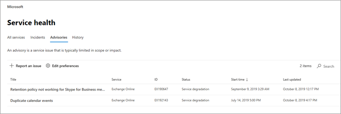

# Office 365 서비스 상태를 확인하는 방법How to check Office 365 service health

[관리 센터](https://go.microsoft.com/fwlink/p/?linkid=2024339)의 Office 365 **서비스 상태** 페이지에서 웹, YAMMER, Microsoft Dynamics CRM 및 microsoft Intune 클라우드 서비스를 포함 하는 microsoft 서비스의 상태를 볼 수 있습니다.You can view the health of your Microsoft services, including Office on the web, Yammer, Microsoft Dynamics CRM, and Microsoft Intune cloud services, on the Office 365 **Service health** page in the [admin center](https://go.microsoft.com/fwlink/p/?linkid=2024339). 클라우드 서비스와 관련된 문제가 발생한 경우 지원 서비스에 문의하거나 문제 해결에 시간을 소비하기 전에 먼저 서비스 상태를 확인하여 이 문제가 현재 해결이 진행 중인 상태인 알려진 문제인지 확인할 수 있습니다.If you are experiencing problems with a cloud service, you can check the service health to determine whether this is a known issue with a resolution in progress before you call support or spend time troubleshooting.

서비스 포털에 로그인 할 수 없는 경우 [서비스 상태 페이지](https://status.office365.com) 를 사용 하 여 테 넌 트에 로그인 하지 못하도록 하는 알려진 문제를 확인할 수 있습니다.If you are unable to sign in to the service portal, you can use the [service status page](https://status.office365.com) to check for known issues preventing you from logging into your tenant.
  
### 서비스 상태 확인 방법How to check service health

1. 관리 센터 [https://admin.microsoft.com](https://go.microsoft.com/fwlink/p/?linkid=2024339)에서으로 이동 하 고 관리자 계정으로 로그인 합니다.Go to the admin center at [https://admin.microsoft.com](https://go.microsoft.com/fwlink/p/?linkid=2024339), and sign in with an admin account.

    > [!NOTE]
    > 전역 관리자 또는 서비스 관리자 역할이 할당된 사용자는 서비스 상태를 볼 수 있습니다.People who are assigned the global admin or service administrator role can view service health. Exchange, SharePoint 및 비즈니스용 Skype 관리자가 서비스 상태를 볼 수 있도록 하려면 이러한 관리자에게도 서비스 관리자 역할을 할당해야 합니다.To allow Exchange, SharePoint, and Skype for Business admins to view service health, they must also be assigned the Service admin role. 서비스 상태를 볼 수 있는 역할에 대 한 자세한 내용은 [정보 관리 역할](https://docs.microsoft.com/office365/admin/add-users/about-admin-roles?view=o365-worldwide#roles-available-in-the-microsoft-365-admin-center)을 참조 하십시오.For more information about roles that can view service health, see [About admin roles](https://docs.microsoft.com/office365/admin/add-users/about-admin-roles?view=o365-worldwide#roles-available-in-the-microsoft-365-admin-center).
  
2. 새 관리 센터를 사용 하지 않는 경우 홈 페이지에서 오른쪽 위 모서리에 있는 **새 관리 센터 사용해 보기** 를 선택 합니다.If you are not using the new admin center, on the Home page, select the **Try the new admin center** toggle in the upper-right corner.

3. 서비스 상태를 보려면 관리 센터에서 **상태** > **서비스 상태**를 이동 하거나 **홈 대시보드에서** **서비스 상태** 카드를 선택 합니다.To view service health, in the admin center, go to **Health** > **Service health**, or select the **Service health** card on the **Home dashboard**. 대시보드 카드에는 활성 서비스 문제가 있는지와 자세한 **서비스 상태** 페이지에 대 한 링크가 표시 됩니다.The dashboard card indicates whether there is an active service issue and links to the detailed **Service health** page.
  
4. **서비스 상태** 페이지에서 각 클라우드 서비스의 상태는 표 형식으로 표시 됩니다.On the **Service health** page, the health state of each cloud service is shown in a table format.

   

**모든 서비스** 탭 (기본 보기)에는 모든 서비스와 해당 현재 상태가 표시 됩니다.The **All services** tab (the default view) shows all services and their current health state. 아이콘 및 **상태** 열은 각 서비스의 상태를 나타냅니다.An icon and the **Status** column indicate the state of each service. 현재 인시던트가 발생 하는 서비스에 대 한 보기를 필터링 하려면 페이지 맨 위에 있는 **인시던트** 탭을 선택 합니다.To filter your view to services currently experiencing an incident, select the **Incidents** tab at the top of the page. **권고** 탭을 선택 하면 현재 권고가 게시 된 서비스만 표시 됩니다.Selecting the **Advisories** tab will show only services that currently have an advisory posted. **기록** 탭에는 해결 된 사건 및 권고의 기록이 표시 됩니다.The **History** tab shows the history of incidents and advisories that have been resolved.

Office 365 서비스에 문제가 발생 하 여 **서비스 상태** 페이지에 표시 되지 않으면 **문제점 보고**를 선택 하 고 간단한 양식을 작성 하 여이에 대해 알려주십시오.If you're experiencing an issue with an Office 365 service and you don’t see it listed on the **Service health** page, tell us about it by selecting **Report an issue**, and completing the short form. Microsoft는 다른 조직에서 제공 하는 데이터 및 보고서를 살펴보고 문제가 광범위 하 게 진행 된 경우와 서비스에서 시작 되었는지 확인 합니다.We’ll look at related data and reports from other organizations to see how widespread the issue is, and if it originated with our service. 문제가 해결 된 경우 **서비스 상태** 페이지에 새 인시던트 또는 권고로 추가 하 여 확인을 추적할 수 있습니다.If it did, we’ll add it as a new incident or advisory on the **Service health** page, where you can track its resolution. 30 분 이내에 목록에 표시 되지 않는 경우에는 지원 서비스에 문의 하 여 문제를 해결 해 보세요.If you don’t see it appear on the list within about 30 minutes, consider contacting support to resolve the issue.

> [!TIP]
> 모바일 장치에서 [Office 365 관리 앱](https://go.microsoft.com/fwlink/p/?linkid=627216)을 사용하여 서비스 상태를 볼 수도 있습니다. 이 방법은 푸시 알림을 통해 최신 상태를 유지하는 좋은 방법입니다.You can also use the [Office 365 Admin app](https://go.microsoft.com/fwlink/p/?linkid=627216) on your mobile device to view Service health, which is a great way to stay current with push notifications. 
  
### 게시된 서비스 상태의 세부 정보 보기View details of posted service health

**모든 서비스** 보기에서 서비스 상태를 선택 하면 권고 또는 사건에 대 한 요약 보기가 열립니다.On the **All services** view, selecting the service status will open a summary view of advisories or incidents.
  

권고 또는 인시던트 요약은 다음 정보를 제공합니다.The advisory or incident summary provides the following information:

- **제목** -문제에 대 한 요약입니다.**Title** - A summary of the problem.
- **서비스** -영향을 받는 서비스의 이름입니다.**Service** - The name of the affected service.
- **ID** -문제의 숫자 id입니다.**ID** - A numeric identifier for the problem.
- **Status** -이 문제가 서비스에 미치는 영향**Status** - How this problem affects the service.
- **시작 시간** -문제가 시작 된 시간입니다.**Start time** - The time when the issue started.
- **Last updated** -서비스 상태 메시지가 마지막으로 업데이트 된 시간입니다.**Last updated** - The last time that the service health message was updated. 솔루션을 적용 하는 과정의 진행 상태를 알 수 있도록 메시지를 자주 게시 합니다.We post frequent messages to let you know the progress that we're making in applying a solution.

솔루션에서 작업 하는 동안 게시 된 모든 메시지 [기록을](#history) 비롯 하 여 문제에 대 한 자세한 정보를 표시 하는 문제 정보 페이지를 보려면 문제점 제목을 선택 합니다.Select the issue title to see the issue detail page, which shows more information about the issue, including the [history](#history) of all messages posted while we work on a solution.

### 서비스 상태 세부 정보 번역Translate service health details

서비스 상태 설명은 실시간으로 게시되므로 해당 언어로 자동 번역되지 않으며 서비스 이벤트의 세부 정보는 영어로만 제공됩니다. 설명을 번역하려면 다음 단계를 수행합니다.Because service health explanations are posted in real-time, they are not automatically translated to your language and the details of a service event are in English only. To translate the explanation, follow these steps:
  
1. 1.[번역기](https://www.bing.com/translator/)로 이동합니다.Go to [Translator](https://www.bing.com/translator/).

2. **서비스 상태** 페이지에서 인시던트 또는 권고를 선택합니다. **세부 정보 표시** 아래에서 문제에 대한 텍스트를 복사합니다.On the **Service health** page, select an incident or advisory. Under **Show details**, copy the text about the issue.

3. 번역기에서 텍스트를 붙여넣고 **번역하기**을 선택합니다.In Translator, paste the text and choose **Translate**.

### 정의Definitions

대부분의 경우 서비스는 추가 정보 없이 정상 상태로 표시 됩니다.Most of the time, services will appear as healthy with no further information. 서비스에 문제가 있으면 문제가 권고 또는 인시던트로 식별되고 현재 상태를 표시합니다.When a service is having a problem, the issue is identified as either an advisory or an incident and shows a current status.
  
> [!TIP]
> 계획된 유지 관리 이벤트는 서비스 상태에 표시되지 않습니다. **메시지 센터**를 통해 최신 상태를 유지함으로써 계획된 유지 관리 이벤트를 추적할 수 있습니다. 변경 계획으로 분류된 메시지로 필터링하여 변경이 발생하는 시기, 해당 효과 및 이러한 변경에 대해 준비하는 방법을 확인하세요. 자세한 내용은 [Office 365의 메시지 센터](https://support.office.com/article/38fb3333-bfcc-4340-a37b-deda509c2093)를 참조하세요.Planned maintenance events aren't shown in service health. You can track planned maintenance events by staying up to date with the **Message center**. Filter to messages categorized as Plan for change to find out when the change is going to happen, its effect, and how to prepare for it. See [Message center in Office 365](https://support.office.com/article/38fb3333-bfcc-4340-a37b-deda509c2093) for more details.
  
### 인시던트 및 권고Incidents and advisories

|||
|:-----|:-----|
||서비스에 권고가 표시되면 Microsoft에서 일부 사용자에게 영향을 미치는 문제를 알고 있지만, 서비스를 계속 사용할 수는 있습니다. 권고에는 일반적으로 문제에 대한 해결 방법이 있으며, 문제가 일시적으로 발생하는 것일 수 있거나 범위 및 사용자 영향에서 제한적입니다.If a service has an advisory shown, we are aware of a problem that is affecting some users, but the service is still available. In an advisory, there is often a workaround to the problem and the problem may be intermittent or is limited in scope and user impact.    |
||서비스에 활성 인시던트가 표시되면 이 인시던트가 중요 문제이며 서비스 또는 서비스의 주요 기능을 사용할 수 없습니다. 예를 들어 사용자가 전자 메일을 보내고 받을 수 없거나 로그인할 수 없습니다. 인시던트는 사용자에게 눈에 띄는 영향을 줍니다. 진행 중인 인시던트가 있는 경우 서비스 상태 대시보드에서 조사, 완화 노력 및 해결 확인과 관련된 업데이트를 제공합니다.If a service has an active incident shown, it's a critical issue and the service or a major function of the service is unavailable. For example, users may be unable to send and receive email or unable to sign-in. Incidents will have noticeable impact to users. When there is an incident in progress, we will provide updates regarding the investigation, mitigation efforts, and confirmation of resolution in the Service health dashboard.    |

### 상태 정의Status definitions

|**상태****Status**|**정의****Definition**|
|:-----|:-----|
|**조사****Investigating** | Microsoft에서 잠재적인 문제를 알고 있으며 문제의 상황과 영향의 범위에 대한 추가 정보를 수집하고 있습니다.We're aware of a potential issue and are gathering more information about what's going on and the scope of impact. |
|**서비스 저하****Service degradation** | Microsoft에서 서비스 또는 기능 사용에 영향을 줄 수 있는 문제가 있음을 확인했습니다. 서비스가 평소보다 느리게 작동하거나, 일시적인 중단이 발생하거나, 기능이 작동하지 않는 등의 경우에 이 상태가 표시될 수 있습니다.We've confirmed that there is an issue that may affect use of a service or feature. You might see this status if a service is performing more slowly than usual, there are intermittent interruptions, or if a feature isn't working, for example. |
|**서비스 중단****Service interruption** | 문제가 사용자의 서비스 액세스 기능에 영향을 준다고 판단한 이 상태가 표시됩니다. 이 경우 문제가 중대하며 일관되게 재현될 수 있습니다.You'll see this status if we determine that an issue affects the ability for users to access the service. In this case, the issue is significant and can be reproduced consistently. |
|**서비스를 복원하는 중****Restoring service** | 문제의 원인이 식별되었으며, Microsoft에서 수행할 정정 작업을 알고 있고 서비스를 다시 정상 상태로 복원하는 프로세스를 진행하고 있습니다.The cause of the issue has been identified, we know what corrective action to take, and are in the process of bringing the service back to a healthy state. |
|**확장된 복구****Extended recovery** | 이 상태는 대부분의 사용자에 대해 서비스를 복원하기 위한 정정 작업이 진행 중이지만, 영향을 받는 모든 시스템에 이를 적용하는 데 시간이 다소 소요될 것임을 나타냅니다. 영구적인 수정 사항을 적용하기 위해 대기하는 동안 영향을 줄이기 위해 임시 수정 사항을 적용한 경우에도 이 상태가 표시될 수 있습니다.This status indicates that corrective action is in progress to restore service to most users but will take some time to reach all the affected systems. You might also see this status if we've made a temporary fix to reduce impact while we wait to apply a permanent fix. |
|**조사 일시 중단됨****Investigation suspended** | 잠재적 문제에 대한 자세한 조사 결과, 추가 조사를 하기 위한 고객의 추가 정보가 필요한 경우 이 상태가 표시됩니다. 고객의 행동이 요구되는 경우 필요한 데이터나 로그를 알려드립니다.If our detailed investigation of a potential issue results in a request for additional information from customers to allow us to investigate further, you'll see this status. If we need you to act, we'll let you know what data or logs we need. |
|**서비스 복원됨****Service restored** | Microsoft에서 정정 작업이 기본 문제를 해결했으며 서비스가 정상 상태로 복원되었음을 확인했습니다. 문제를 확인하려면 문제 세부 정보를 확인하세요.We've confirmed that corrective action has resolved the underlying problem and the service has been restored to a healthy state. To find out what went wrong, view the issue details. |
|**사후 문제 보고서 게시 됨****Post-incident report published** | Microsoft는 근본 원인 정보를 포함 하는 특정 문제와 유사한 문제가 다시 발생 하지 않도록 하는 다음 단계에 대 한 사후 문제 보고서를 게시 했습니다.We’ve published a Post Incident Report for a specific issue that includes root cause information and next steps to ensure a similar issue doesn’t reoccur. |

### 기록History

서비스 상태를 통해 현재 상태를 확인 하 고 최근 30 일 이내에 테 넌 트에 영향을 받은 모든 서비스 권고 및 인시던트 기록을 볼 수 있습니다.Service health lets you look at current health status and view the history of any service advisories and incidents that have affected your tenant in the past 30 days. 모든 서비스의 이전 상태를 보려면 문제 정보 페이지에서 **기록 보기** 를 선택 합니다.To view the past health of all services, select **View history** on the issue detail page.
  

  
선택한 시간 범위에서 게시된 모든 서비스 상태 메시지 목록이 다음과 같이 표시됩니다.A list of all service health messages posted in the selected timeframe is displayed, as shown below:
  

  
모든 행을 확장 하 여 문제에 대 한 세부 정보를 표시 합니다.Expand any row to view more details about the issue.
  
가동 시간에 대 한 자세한 내용은 [Office 365의 투명 작업](https://go.microsoft.com/fwlink/?linkid=848695)을 참조 하세요.For more information about our commitment to uptime, see [Transparent operations from Office 365](https://go.microsoft.com/fwlink/?linkid=848695).
  
## 사용자 의견 남기기Leave feedback

Microsoft의 목표는 진행 중인 문제에 대해 고객에게 제공하는 정보가 시기적절하고 정확하며 유용하도록 하는 것입니다. Microsoft에 대해 평가하려면 별 등급을 선택하세요. 별 1~5개 등급으로 점수를 입력하면 특정 세부 정보에 대한 사용자 의견을 남길 수 있습니다. Microsoft에서는 사용자 의견을 사용하여 서비스 상태 시스템을 세밀하게 조정합니다.Our goal is to make sure that the information we provide to you about an ongoing issue is timely, accurate, and useful. To tell us how we're doing, select a star rating. After you give us a score from 1 to 5 stars, you can give feedback on any specific details. We'll use your feedback to fine-tune our service health system.
  
## 참고 항목See also

[Microsoft 365 관리 센터의 활동 보고서Activity Reports in the Microsoft 365 admin center](https://support.office.com/article/0d6dfb17-8582-4172-a9a9-aed798150263)