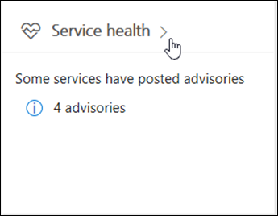

# Office 365 서비스 상태를 확인하는 방법

관리 센터에서 Office 365 **서비스 상태** 페이지에서 Office 365, Yammer, Microsoft Dynamics CRM 및 Microsoft Intune 클라우드 서비스의 상태를 볼 수 있습니다. 클라우드 서비스에 문제가 발생 하는 경우에 지원팀에 문의 하거나 시간을 백분율로 나타내는 시간 문제를 해결 하기 전에 진행 중인 해상도 알려진된 문제가 인지 여부를 확인 하려면 서비스 상태를 확인할 수 있습니다. 

서비스 포털에 로그인 할 수 없는 경우에에서 테 넌 트에 로그인 하는 경우를 방지 하는 알려진된 문제를 확인 하는 [서비스 상태 페이지](https://status.office365.com) 를 사용할 수 있습니다.
  
### 서비스 상태 확인 방법

1. [https://portal.office.com/adminportal/home](https://portal.office.com/adminportal/home#/homepage)으로 이동하여 관리자 계정으로 로그인합니다. 
    
    > [!NOTE]
    > 전역 관리자 또는 서비스 관리자 역할이 할당된 사용자는 서비스 상태를 볼 수 있습니다. Exchange, SharePoint 및 비즈니스용 Skype 관리자가 서비스 상태를 볼 수 있도록 하려면 이러한 관리자에게도 서비스 관리자 역할을 할당해야 합니다.
  
2. 관리 센터에서 서비스 상태를 열려면 **상태**로 이동 > **서비스 상태**하거나 **홈 대시보드** **서비스 상태 카드** 를 클릭 합니다. 대시보드 카드 활성 서비스 문제 및 자세한 서비스 상태 페이지에 대 한 링크를 인지를 나타냅니다.
    
    
  
3. 각 클라우드 서비스의 상태는 가능한 상태를 표시하는 아이콘이 포함된 표 형식으로 표시됩니다.
    
> [!TIP]
> 모바일 장치에서 [Office 365 관리 앱](https://go.microsoft.com/fwlink/p/?linkid=627216)을 사용하여 서비스 상태를 볼 수도 있습니다. 이 방법은 푸시 알림을 통해 최신 상태를 유지하는 좋은 방법입니다. 
  
### 게시된 서비스 상태의 세부 정보 보기

기본 보기에서 모든 서비스 및 현재 상태 상태로 표시 됩니다. 인시던트를 발생 하는 현재 서비스에 보기를 필터링 하려면 음영 처리 된 막대를 왼쪽에에서 **인시던트** 를 선택 합니다. **권고** 를 선택 하면 현재 게시 하는 권고를가지고 있는 서비스에만 표시 됩니다. **모든 서비스** 보기에서 표시 된 서비스의 상태를 클릭 하면 자문 또는 사고 요약 보기를 열립니다. 
  

  
권고 또는 인시던트 요약은 다음 정보를 제공합니다. 
  

  
1. 문제 식별자 및 문제에 대한 요약 설명.
    
2. 현재 상태. 각 잠재적 상태에 대한 설명은 이 문서의 상태 정의를 참조하세요.
    
3. 이 문제가 사용자에게 영향을 줄 수 있는 방법에 대한 설명.
    
4. 문제가 시작된 시간과 서비스 상태 메시지가 마지막으로 업데이트된 시간. 문제가 지속되는 기간 내내 해결 방법을 적용하는 것과 관련한 진행 상태를 알 수 있도록 메시지를 빈번하게 게시합니다.
    
5. 해결 방법에 대해 작업하는 동안 게시된 모든 메시지 기록을 비롯한 문제에 대한 세부 정보를 보려면 **세부 정보 표시** 링크를 선택합니다. 
    
### 서비스 상태 세부 정보 번역

서비스 상태 설명은 실시간으로 게시되므로 해당 언어로 자동 번역되지 않으며 서비스 이벤트의 세부 정보는 영어로만 제공됩니다. 설명을 번역하려면 다음 단계를 수행합니다.
  
1. 1.[번역기](https://www.bing.com/translator/)로 이동합니다.
    
2. **서비스 상태** 페이지에서 인시던트 또는 권고를 선택합니다. **세부 정보 표시** 아래에서 문제에 대한 텍스트를 복사합니다.
    
3. 번역기에서 텍스트를 붙여넣고 **번역하기**을 선택합니다.
    
### 정의

대부분의 시간에 서비스는 추가 정보 없이 정상으로 표시됩니다. 서비스에 문제가 있으면 문제가 권고 또는 인시던트로 식별되고 현재 상태를 표시합니다.
  
> [!TIP]
> 계획된 유지 관리 이벤트는 서비스 상태에 표시되지 않습니다. **메시지 센터**를 통해 최신 상태를 유지함으로써 계획된 유지 관리 이벤트를 추적할 수 있습니다. 변경 계획으로 분류된 메시지로 필터링하여 변경이 발생하는 시기, 해당 효과 및 이러한 변경에 대해 준비하는 방법을 확인하세요. 자세한 내용은 [Office 365의 메시지 센터](https://support.office.com/article/38fb3333-bfcc-4340-a37b-deda509c2093)를 참조하세요. 
  
### 인시던트 및 권고

|||
|:-----|:-----|
||서비스에 권고가 표시되면 Microsoft에서 일부 사용자에게 영향을 미치는 문제를 알고 있지만, 서비스를 계속 사용할 수는 있습니다. 권고에는 일반적으로 문제에 대한 해결 방법이 있으며, 문제가 일시적으로 발생하는 것일 수 있거나 범위 및 사용자 영향에서 제한적입니다.    |
||서비스에 활성 인시던트가 표시되면 이 인시던트가 중요 문제이며 서비스 또는 서비스의 주요 기능을 사용할 수 없습니다. 예를 들어 사용자가 전자 메일을 보내고 받을 수 없거나 로그인할 수 없습니다. 인시던트는 사용자에게 눈에 띄는 영향을 줍니다. 진행 중인 인시던트가 있는 경우 서비스 상태 대시보드에서 조사, 완화 노력 및 해결 확인과 관련된 업데이트를 제공합니다.    |
   
### 상태 정의

|**상태**|**정의**|
|:-----|:-----|
|**조사하는 중** | Microsoft에서 잠재적인 문제를 알고 있으며 문제의 상황과 영향의 범위에 대한 추가 정보를 수집하고 있습니다. |
|**서비스 저하** | Microsoft에서 서비스 또는 기능 사용에 영향을 줄 수 있는 문제가 있음을 확인했습니다. 서비스가 평소보다 느리게 작동하거나, 일시적인 중단이 발생하거나, 기능이 작동하지 않는 등의 경우에 이 상태가 표시될 수 있습니다. |
|**서비스 중단** | 문제가 사용자의 서비스 액세스 기능에 영향을 준다고 판단한 이 상태가 표시됩니다. 이 경우 문제가 중대하며 일관되게 재현될 수 있습니다. |
|**서비스를 복원하는 중** | 문제의 원인이 식별되었으며, Microsoft에서 수행할 정정 작업을 알고 있고 서비스를 다시 정상 상태로 복원하는 프로세스를 진행하고 있습니다. |
|**확장된 복구** | 이 상태는 대부분의 사용자에 대해 서비스를 복원하기 위한 정정 작업이 진행 중이지만, 영향을 받는 모든 시스템에 이를 적용하는 데 시간이 다소 소요될 것임을 나타냅니다. 영구적인 수정 사항을 적용하기 위해 대기하는 동안 영향을 줄이기 위해 임시 수정 사항을 적용한 경우에도 이 상태가 표시될 수 있습니다. |
|**조사 일시 중단됨** | 잠재적 문제에 대한 자세한 조사 결과, 추가 조사를 하기 위한 고객의 추가 정보가 필요한 경우 이 상태가 표시됩니다. 고객의 행동이 요구되는 경우 필요한 데이터나 로그를 알려드립니다. |
|**서비스 복원됨** | Microsoft에서 정정 작업이 기본 문제를 해결했으며 서비스가 정상 상태로 복원되었음을 확인했습니다. 문제를 확인하려면 문제 세부 정보를 확인하세요. |
|**게시 된 이후 문제 보고서** | 루트 원인 정보 및 비슷한 문제가 발생 하지 확인 하려면 다음 단계를 포함 하는 특정 문제에 대 한 게시물 위해 문제 보고서를 게시 한 했습니다. |
   
## 기록

서비스 상태를 통해 현재 상태를 확인하고 지난 30일간의 모든 서비스 권고 및 인시던트 기록을 볼 수 있습니다. 모든 서비스의 과거 상태를 보려면 **서비스 상태** 페이지에서 **기록 보기**를 선택합니다. 
  

  
선택한 시간 범위에서 게시된 모든 서비스 상태 메시지 목록이 다음과 같이 표시됩니다.
  

  
7 일이 지난 또는 지난 30 일에 대 한 상태 기록을 볼 수 있습니다. 이 문제에 대 한 자세한 세부 정보를 보려면 모든 행을 선택 합니다.
  
가동 시간을 위한 노력 하는 방법에 대 한 자세한 내용은 [Office 365에서 투명 하 게 작업](https://go.microsoft.com/fwlink/?linkid=848695)을 참조 하십시오.
  
## 사용자 의견 남기기

Microsoft의 목표는 진행 중인 문제에 대해 고객에게 제공하는 정보가 시기적절하고 정확하며 유용하도록 하는 것입니다. Microsoft에 대해 평가하려면 별 등급을 선택하세요. 별 1~5개 등급으로 점수를 입력하면 특정 세부 정보에 대한 사용자 의견을 남길 수 있습니다. Microsoft에서는 사용자 의견을 사용하여 서비스 상태 시스템을 세밀하게 조정합니다.
  

  
## 참고 항목

[Office 365 관리 센터의 활동 보고서](https://support.office.com/article/0d6dfb17-8582-4172-a9a9-aed798150263)

